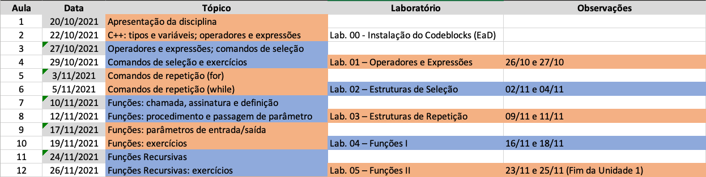
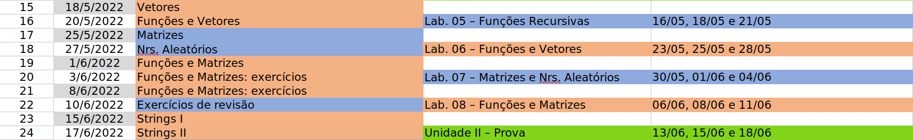
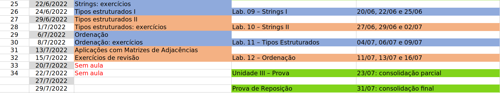
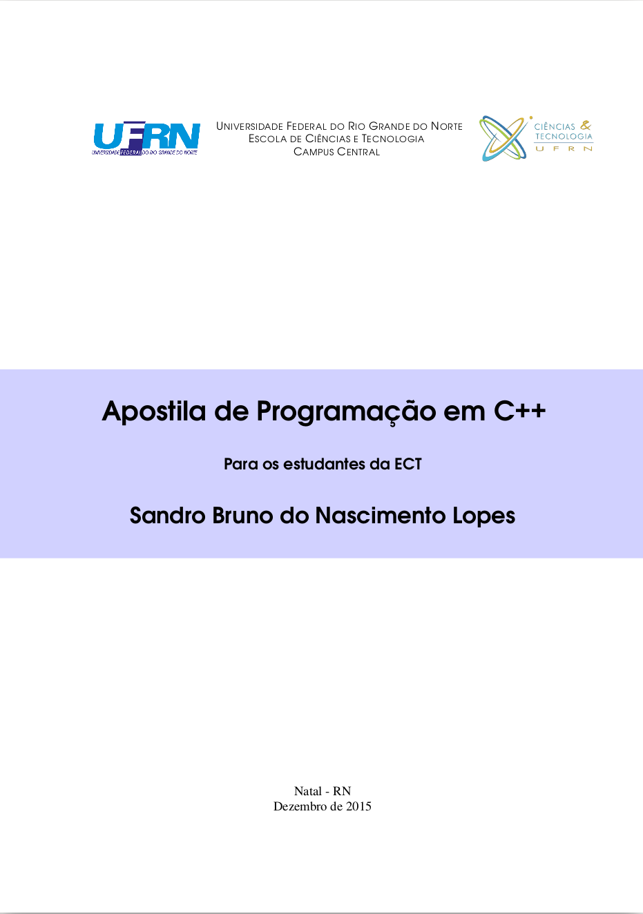
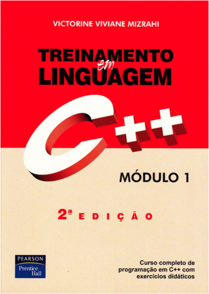
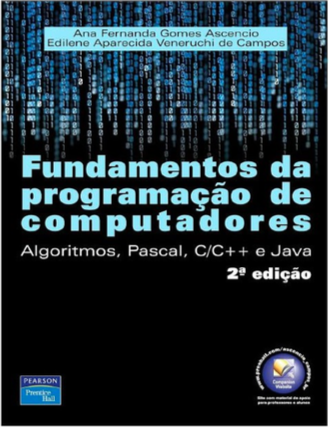

### Linguagem de Programação
#### Introdução
--- 

### Linguagem de Programação

Perguntas pertinentes sobre Linguagem de Programação (LiP) na ECT:

- Por que é tão importante?
- Por que 90h?
- Qual a relação com o curso de Bacharelado em Ciências e Tecnologia?
---

### Linguagem de Programação
#### Relação da Disciplina com o Curso

- Para responder esta pergunta, é interessante enumerar as competências
  e habilidades previstas para os bachareis em CeT
- Mais informações [Projeto Pedagógico do Curso](https://sigaa.ufrn.br/sigaa/public/curso/ppp.jsf?lc=pt_BR&id=10320810)
---

### Linguagem de Programação
#### Competências e Habilidades
1. **capacidade de identificar, avaliar e resolver problemas, enfrentar desafios e responder
a novas demandas da sociedade contemporânea**
2. **capacidade de comunicação e argumentação em suas múltiplas formas**
3. **capacidade de atuar em áreas de fronteira e interfaces de diferentes disciplinas e campos de saber**
4. **atitude investigativa, de prospecção, de permanente busca e produção do conhecimento**
---

### Linguagem de Programação
#### Competências e Habilidades
5. capacidade de reconhecer especificidades regionais ou locais, contextualizando-as e relacionando-as com a situação global
6. **atitude ética nas esferas profissional, acadêmica e das relações interpessoais**
7. comprometimento com a sustentabilidade nas relações entre ciência, tecnologia, economia, sociedade e ambiente
8. **capacidade de tomar decisões em cenários de imprecisões e incertezas**
---

### Linguagem de Programação
#### Competências e Habilidades

Como é possível ver, o curso de Linguagem de Programação (LiP)
é bem completo quanto ao seu envolvimento com as competências
e habilidades desejadas de um bacharel em CeT.

---

### Apresentação
- Prof. Dr. Bruno Silva
- Atendimento:
    - Via email: bruno.silva@ect.ufrn.br
    - Via Discord
    - Horário para a turma: terças e quintas, das 15h às 16h
- Áreas de interesse:
    - Processamento de imagens e visão computacional
    - Inteligência artificial e robótica
---

### Sobre a Disciplina
- Aulas teóricas: quartas e sextas, de 16:50 às 18:30,
  via Google Meet
- Carga horária total: 90 horas
    - Teoria: 60 horas
    - Laboratório: 30 horas
- Metodologia
    - Aulas expositivas com slides digitais
    - Apresentação de um tópico de aula seguido por exercícios relacionados
    - Atividades práticas em laboratório
---

### Laboratórios
- Professor responsável:
    - Prof. Dr. Francisco Vidal
- Horários:
    - Subturma 2A: Terça, 7:00 às 8:40 
    - Subturma 2B: Terça, 8:55 às 10:35
    - Subturma 2C: Quinta, 7:00 às 8:40
    - Subturma 2D: Quinta, 8:55 às 10:35
---

### Avaliações
- Avaliação semanal:
    - Avaliação continuada
    - Práticas de laboratório envolvendo o conteúdo
      dado na semana anterior
- Assiduidade
    - Presenças serão registradas por chamada oral
      em todas as aulas
---

### Sobre a Disciplina: Observação Importante
Regimento Interno/UFRN, Seção III:

- Prevê punições para casos de:
    - Fraudes (colas)
    - Perturbação ao andamento normal das atividades
    - Ofensas a servidores da universidade
---

### Cronograma
#### Unidade 1

---

### Cronograma
#### Unidade 2

---

### Cronograma
#### Unidade 3

---

### Livros Utilizados

---

### Perguntas Frequentes

- _Posso assistir aula em uma subturma de laboratório que não seja a minha?_
Entre em contato com o professor responsável pela sua subturma
para se informar sobre esta questão.

- _Esta semana tem aula de laboratório?_
Na disciplina de LiP, os laboratórios são semanais.
Caso não haja nenhum aviso (no SIGAA), a resposta
provavelmente é sim.
Na dúvida, confira o plano de aulas no SIGAA.
---

### Perguntas Frequentes

- _Meu programa enviado no Multiprova/Sistema LoP deu 100% correto.
Por que a minha nota não foi 10?_
O seu programa ter 100% de acerto não implica no fato de que
você implementou a questão como solicitada.

- _Acho curto o tempo para entrega das questões de lab.
Por que não estender este prazo?_
As questões são elaboradas para serem entregues em um determinado
prazo. O fato de você não conseguir entregá-las significa
que o seu nível de desenvoltura com a disciplina está abaixo
do esperado.
---

### Perguntas Frequentes

- _Posso utilizar o recurso XYZ (p. ex. vetores) em uma ativiadade, mesmo que ele ainda não tenha sido apresentado em sala de aula? E quanto a recursos não passados pelo professor?_
Não. Todas as atividades avaliativas são elaboradas de forma que o aluno seja avaliado considerando o conteúdo que a ele foi passado até o momento da atividade.
---

### Experiências Passadas em LiP

A partir de experiências em turmas passadas no ensino remoto,
algumas fontes de problema na disciplina:

- Aluno que não **ouve** o professor
    - Paradoxo: se o aluno não ouve o professor, ele também não irá
      ouvir esta afirmação e portanto, o problema não tem solução
    - Por exemplo: quantos daqui ouviram os argumentos da importância de LiP?
- Aluno que não está com o preparo necessário para uma atividade
---

### Experiências Passadas em LiP

A partir de experiências em turmas passadas no ensino remoto,
algumas fontes de problema na disciplina:

- Aluno que acha que está aprendendo, mas não está
    - Por exemplo, aluno que costuma fazer trabalhos em grupo ou acha
      que programação se aprende vendo alguém praticar
- Aluno que quer burlar o sistema de avaliação
---

### Demais Perguntas

Sintam-se à vontade para fazer qualquer pergunta sobre a disciplina ou sobre o professor
---