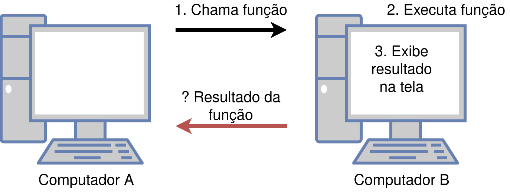

### Linguagem de Programação
#### Funções II
---

### Aula Anterior
Aula anterior: uso de funções em C++
- Chamada a funções
- Assinatura de funções
- Definição de funções
---

### Funções
Revisando a ideia de funções:
- Parâmetros são a porta de entrada de funções
- O tipo de retorno é a sua saída
> Este mecanismo estabelece uma forma de uma função "conversar" com uma outra
> Por exemplo: função `main` que faz uma chamada à função `sqrt`
---

### Funções
Devemos ter em mente que:
- Nem sempre uma função deve retornar um resultado
- É possível que uma função modifique o valor dos parâmetros, de forma que
  esta modificação seja válida fora da função
---

### Objetivos da Aula
- Introduzir o conceito de função sem retorno
- Introduzir o conceito de passagem de parâmetro por valor e passagem de parâmetro por referência
---

### Assinaturas de Funções
Sintaxe:
```
tipo_da_funcao nome_da_funcao(lista de parametros);
```
- `tipo_da_funcao` é o tipo do valor computado pela função:
  `int, char, float, bool` ou o novo tipo _`void`_
---

### Funções sem Retorno
Funções sem retorno:
- Também conhecidas como *procedimentos*
- Útil para funções que devem escrever na tela
- _Escrever na tela com comando `cout` não é retorno_
- Tipo da função deve ser _`void`_
---

### Funções sem Retorno
Funções sem retorno:
- Útil também para funções que devem modificar os seus parâmetros
- Comando `return` não é obrigatório
    - Pode ser opcionalmente utilizado com a forma `return;`
      (sem nenhuma expressão) para encerrar a função
---

### Funções sem Retorno
#### Exercício
Escrever assinaturas para as funções abaixo:
1. Função que **imprime na tela** o caractere correspondente a
   um número ASCII
2. Função que **imprime na tela** o menor dentre três números reais
3. Função que **imprime na tela** uma mensagem informando se o número
   é primo ou não
---

### Assinaturas de Funções
#### Exercício: Solução
```C++
1. void imprime_caractere(int cod);
2. void imprime_menor(float x, float y, float z);
3. void informa_primo(int x);
```
---

### Funções sem Retorno
Função que imprime na tela o caractere correspondente a um número:

```C++
void imprime_caractere(int n);

int main(){
    int x;
    cout << "Insira um num. inteiro entre 0 e 255:\n";
    cin >> x;
    imprime_caractere(x); //observe a chamada à função
    return 0;
}

void imprime_caractere(int n){
    cout << "Caractere: " << char(n) << endl;
}
```
---

### Funções sem Retorno
É preciso estar claro a diferença entre:
- Uma função que retorna um valor, ex:

```
char converte_numero(int cod);
```

- Uma outra função que imprime o mesmo valor, ex:

```
void imprime_caractere(int cod);
```
---

### Funções sem Retorno

Para entender esta diferença, imagine o
seguinte exemplo hipotético:

- Um programa no computador `A` faz uma chamada a uma função
  a ser executada no computador `B`
- A função no computador `B` é executada
    - O resultado não é retornado: ele é exibido na tela
    - Entretanto, o resultado será exibido na tela do computador `B`
    - O programa no computador `A` não tem acesso ao resultado
      calculado pela fução

---

### Funções sem Retorno



---

### Lista de Presença


<a href="https://bit.ly/3xDZH4v"><p style="text-align:center;">https://bit.ly/3xDZH4v</p></a>

---

### Passagem de Parâmetros
Dentro do corpo de funções, os parâmetros são variáveis locais.
Observe então se o código a seguir está correto:

```C++
void troca(int a, int b);

int main(){
    int n1, n2;
    cout << "Insira dois numeros inteiros:\n";
    cin >> n1 >> n2;
    troca(n1, n2);
    cout << "n1: " << n1 << " n2: " << n2 << endl;
    return 0;
}

void troca(int a, int b){
    int aux = a;
    a = b;
    b = aux;
}
```
---

### Passagem de Parâmetros
- Até agora, utilizamos **passagem de parâmetro por valor**
    - O valor da variável utilizada na chamada é copiado para o parâmetro da 
      função
- Alternativa: **passagem de parâmetro por referência**
    - A variável em si é passada como parâmetro
        - Mesma posição (**referência**) na memória
    - Uso do operador de referência: **`&`**
        - Deve ser usado em cada parâmetro que deve ser modificado
---

### Passagem de Parâmetros
Solução correta (com passagem de parâmetro por referência):

```C++
void troca(int& a, int& b);

int main(){
    int n1, n2;
    cout << "Insira dois numeros inteiros:\n";
    cin >> n1 >> n2;
    troca(n1, n2);
    cout << "n1: " << n1 << " n2: " << n2 << endl;
    return 0;
}

void troca(int& a, int& b){
    int aux = a;
    a = b;
    b = aux;
}
```
---

### Exercício
Implemente uma função que receba como parâmetro três números inteiros e que armazene no primeiro parâmetro o menor dos números, no segundo o segundo menor e no terceiro o maior.

Escreva a função `main`, para ler os três números do usuário, chamar a função e exibir na tela os números em ordem crescente e a média entre o menor e o maior.
---

### Exercício: Solução
```C++
void troca(int& x, int& y);
void ordena_crescente(int& a, int& b, int& c);

int main(){
    int x, y, z;
    cout << "Insira tres nrs.\n";
    cin >> x >> y >> z;

    ordena_crescente(x,y,z);
    cout << "Menor: " << x << endl;
    cout << "Meio: " << y << endl;
    cout << "Maior: " << z << endl;
    cout << "Media: " << float(x + z)/2 << endl;
    return 0;
}

void troca(int& x, int& y){
    int aux = x;
    x = y;
    y = aux;
}

void ordena_crescente(int& a, int& b, int& c){
    int aux;
    if(a > c){
        troca(a, c);
    }
    if(a > b){
        troca(a, b);
    }
    if(b > c){
        troca(b, c);
    }
}
```
---

### Exercício: Solução

Observe que:
- A função `ordena_crescente` chama a função `troca` na sua solução
- A ordem das trocas é importante (a 1a. comparação precisa ser
  entre o 1o. e 3o. parâmetros)

---

### Sumário
Na aula de hoje:
- Funções sem retorno
- Passagem de parâmetro por valor e por referência
---