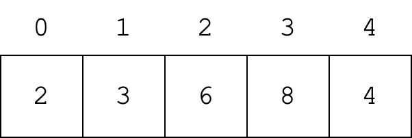
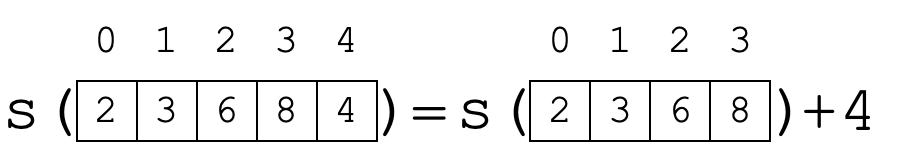
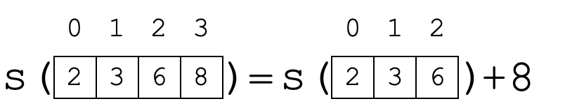
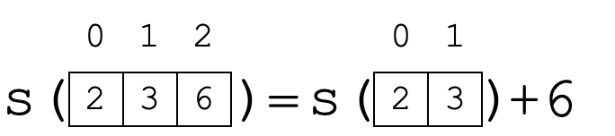
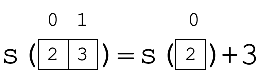
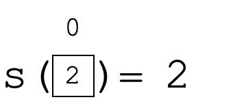

### Linguagem de Programação
#### Funções e Vetores
---

### Na Aula Anterior

Vetores em C++
- Declaração
- Acesso aos elementos
- Inicialização
- Exercícios
---

### Objetivo da Aula
Introduzir o uso de funções que operam sobre vetores
- Sintaxe
- Exercícios
---

### Funções e Vetores
- É possível passar vetores como parâmetro de funções
- Além do vetor a ser passado como parâmetro, é necessário
  um parâmetro adicional $\rightarrow$ o tamanho do vetor
---

### Declaração de Função com Vetores
#### Sintaxe
Exemplo com um vetor como parâmetro:
```C++
tipo_func nome_func(tipo_vetor nome_vetor[], int tam_vetor){
    corpo da funcao
}
```
---

### Declaração de Função com Vetores
#### Sintaxe
Em relação às declarações de funções usadas anteriormente:

- `tipo_vetor` é o tipo do vetor passado como parâmetro:
  `int, char, float, bool`
- `nome_vetor` é o nome do vetor passado como parâmetro. Observe que o
  `[]` é vazio
- `tam_vetor` é o tamanho do vetor passado como parâmetro
---

### Declaração de Função com Vetores
#### Sintaxe
Caso haja mais de um vetor:
- Se tiverem tamanhos diferentes, é necessário
  incluir um parâmetro para o tamanho de cada um
- Se tiverem um mesmo tamanho, basta utilizar
  um único parâmetro para o tamanho
---

### Declaração de Função com Vetores
#### Sintaxe
Exemplo com dois vetores como parâmetros:
```C++
tipo_func nome_func(tipo_vetor nome_vetor1[], int tam_vetor1,
                    tipo_vetor nome_vetor2[], int tam_vetor2){
    corpo da funcao
}
```
---

### Declaração de Função com Vetores
#### Exercícios
Escrever assinatura da função:
1. Que imprime um vetor de inteiros na tela
2. Que recebe um vetor de caracteres e retorna quantos dos elementos
   no vetor são iguais a um caractere passado como parâmetro
3. Que recebe dois vetores de inteiros e retorna o maior valor dentre todos,
   seja ele do primeiro ou do segundo vetor
---

### Declaração de Funções com Vetores
#### Exercícios: Solução
```C++
1. void imprime_vetor(int v[], int tam);
2. int conta_ocorrencias(char v[], int tam, char c);
3. int computa_maior(int v1[], int tam1,
                     int v2[], int tam2);
```
---

### Lista de Presença


<a href="https://bit.ly/3COKwII"><p style="text-align:center;">https://bit.ly/3COKwII</p></a>

---

### Funções com Vetores
#### Chamada de Funções
- Nas chamadas às funções, variáveis do tipo vetor são passadas
  como parâmetros utilizando **apenas o seu nome**
- Exemplo:
```C++
void imprime_vet(int vet[], int n);
int main(){
        int n;
        cin >> n;
        int v[n], i;
        for(i = 0; i < n; i++){
            v[i] = 2*n+i;
        }
        imprime_vet(v, n); //chama função
        return 0;
}
```
---

### Funções com Vetores
#### Passagem de Parâmetros
O que faz o código a seguir?

```C++
void func(int vet[], int n){
    int i;
    for(i = 0; i < n; i++){
        vet[i] = 1;
    }
}
int main(){
        int n;
        cin >> n;
        int v[n], i;
        func(v, n);
        for(i = 0; i < n; i++){
            cout << v[i] << " ";
        }
        cout << endl;
        return 0;
}
```
---

### Funções com Vetores
#### Passagem de Parâmetros
- Todo vetor passado para funções como parâmetro
  é passado por _referência_
- Isto significa dizer que as alterações realizadas nos
  vetores dentro da função permanecem após a função ser finalizada
- Ou seja, todo vetor é um parâmetro de entrada e saída (ao mesmo tempo)
---

### Funções com Vetores
#### Função com Vetores como Resultados

- Em C++, **não** é possível retornar um vetor com o comando
  `return`
- Em outras palavras, a assinatura seguinte **não é permitida**:

```
int[] soma_vetores(int v1[], int v2[], int n);
```

- Caso a função calcule um ou mais vetores, ela deve armazenar o resultado
  nos parâmetros da função
---

### Exercícios:
1. Implemente uma função chamada `le_vet`, para ler os elementos
   de um vetor de números inteiros de tamanho `n`
2. Implemente uma função que recebe como parâmetros de
   entrada um vetor de caracteres e um caractere.
   A função deve retornar quantos dos caracteres no vetor são iguais ao caractere passado como parâmetro
---

### Funções com Vetores
#### Funções Recursivas
- Funções recursivas também podem ser utilizadas com vetores
- Em geral, a recursividade é alcançada pela divisão do vetor em partes menores:
    - Primeira chamada considera todos as `n` posições de um vetor
    - Segunda chamada considera as `n-1` primeiras posições
    - Terceira chamada considera as `n-2` primeiras posições
    - Passo base: alcançado quando não é possível dividir o vetor,
      ou seja, o seu tamanho é igual a 1
---

### Funções Recursivas
#### Soma dos Valores em um Vetor

Função recursiva para a soma de todos os valores de um vetor:



---

### Funções Recursivas
#### Soma dos Valores em um Vetor

A primeira chamada à função `soma` divide o vetor em duas partes:
um nr. inteiro igual ao último valor e um vetor contendo os demais valores.
A função deve ser chamada novamente para o novo vetor



---

### Funções Recursivas
#### Soma dos Valores em um Vetor

O mesmo acontece para todas as demais chamadas:



---

### Funções Recursivas
#### Soma dos Valores em um Vetor



---

### Funções Recursivas
#### Soma dos Valores em um Vetor



---

### Funções Recursivas
#### Soma dos Valores em um Vetor

Quando o vetor possui apenas um valor, o passo base é alcançado



---

### Funções Recursivas
#### Soma dos Valores em um Vetor
Após isto, as chamadas que estão empilhadas utilizam os
resultados calculados para serem desempilhadas e calcular
a soma de todos os valores do vetor:

- `s([2,3]) = 5`
- `s([2,3,6]) = 11`
- `s([2,3,6,8]) = 19`
- `s([2,3,6,8,4]) = 23`

---

## Funções Recursivas
#### Soma dos Valores em um Vetor

Função resultante:

```C++
int soma(int v[], int n){
    if(n == 1){
        return v[0];
    }
    else{
        return soma(v, n-1) + v[n-1];
    }
}
```

---

## Exercícios:
1. Implemente uma função recursiva chamada `imprime_vet`, para
   imprimir os elementos de um vetor de números inteiros de tamanho\
   `n` na tela
    - Caso os valores tenham sido impressos na ordem inversa dos valores digitados, modifique a função para imprimir os valores na mesma ordem
2. Implemente a questão 2 anterior (contar quantos caracteres
   de um vetor são iguais a um caractere passado como parâmetro) de forma recursiva 
---

## Sumário
Na aula de hoje:
- Sintaxe de implementação de funções com vetores
- Funções recursivas com vetores
- Exercícios
---