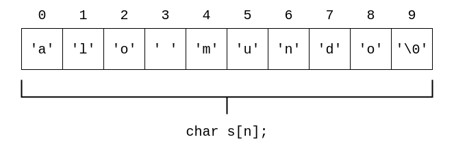

### Linguagem de Programação
#### Strings
---

### Nas Aulas Anteriores

- Funções
- Vetores e matrizes
- Funções com vetores e matrizes
---

### Objetivo da Aula
Introduzir o uso de strings
- Conceito
- Entrada e saída
- Funções de manipulação de strings
---

### Strings
- String: cadeias de caracteres (vários caracteres em sequência)
- Exemplos:
    - `"ect"`
    - `"linguagem de programacao"`
---

### Strings
Ao longo do curso, já utilizamos:
- Variáveis para armazenar um único caractere:<br>
  `char carac;`
- Strings constantes:<br>
  `cout << "Informe o nr. de linhas";`
E quanto a variáveis para armazenar strings?
---

### Strings
Em C++, strings são vetores de `char` com um último caractere especial
- Exemplo: `char s[50];`
- Não iremos utilizar o tipo `string` (disponível em C++)
- Toda string em C++ termina com o caractere `\0`:
    - Caractere especial delimitador de final de string
    - Usado pelos algoritmos/funções que processam strings
---

### Strings
#### Representação em Memória


Então:
- Qual o caractere na terceira posição?
- Qual o caractere `s[5]`?
- Como poderíamos mudar a string para `"ola mundo"`?
- Qual o tamanho da string? O tamanho é a quantidade de todos os caracteres
(menos o caractere especial)
---

### Strings
#### Inicialização
- Forma 1:
```C++
char s[4] = {`e',`c',`t',`\0'};
```
- Forma 2:
```C++
char s[] = {`e',`c',`t',`\0'};
```
- Forma 3 (caractere especial é inserido automaticamente):
```C++
char s[] = "ect";
```
---

### Strings
#### Strings vs. Vetor de Caracteres
Uma string é um vetor de caracteres, mas não o contrário

- String:
```C++
char s[] = {`e',`c',`t', `\0'};
```
- Vetor de caracteres (não delimitado com `\0`):

```C++
char s[] = {`e',`c',`t'};
```

- As regras que valem para vetores valem para strings
- Entretanto, strings oferecem algumas vantagens, como visto a seguir
---

### Strings
#### Comando de Saída
Para imprimir uma string `s`, pode-se usar o comando `cout`, diretamente na variável do tipo string:

```C++
int main(){
    char str[4] = {`e',`c',`t',`\0'};
    cout << str << endl;
    return 0;
}
```
---

### Strings
#### Comando de Saída
- Ou seja, não é necessário utilizar um laço como no caso de vetores
- Isto só funciona para strings bem formadas (terminadas com o caractere delimitador)
    - Caso contrário, serão impressos vários caracteres a mais (lixo de memória)
---

### Strings
#### Comando de Entrada
- Para ler uma string `s` do usuário, pode-se usar o comando `cin`, diretamente na variável do tipo string:

```C++
int main(){
    char str[10];
    cin >> str;
    cout << str << endl;
    return 0;
}
```
---

### Strings
#### Comando de Entrada
- Ou seja, também não é necessário um laço
- Com `cin`, o caractere especial `\0` é inserido automaticamente
- Caso a string possua espaços em branco (`' '`),
  ela deve ser lida com um outro comando
  (próxima aula)
---

### Strings
#### Tamanho Máximo da Variável String
Sobre o tamanho da variável string na declaração:
- No exemplo anterior, a variável `str` tem tamanho máximo 10
    - Lembre-se que nem todos os espaços reservados para a string
      serão necessariamente usados
- Portanto, o tamanho máximo do texto que cabe na string é 9
    - Por causa do espaço destinado ao caractere especial `\0`
---

### Strings
#### Funções da Biblioteca `cstring`
- A biblioteca `cstring` possui algumas funções úteis:
    - `strlen`: computa o tamanho da string
    - `strcpy`: computa uma cópia da string
    - `strcat`: concatena duas strings
    - `strcmp`: compara duas strings
- Ao longo da disciplina, estas funções podem ser usadas da biblioteca
---

### Strings
#### Funções da Biblioteca `cstring`
Assinatura e descrição das funções:
- `int strlen(char s[])`:<br>
  retorna o tamanho da string `s`, usando o caractere delimitador
  para identificar o final da cadeia
- `void strcpy(char dest[], char orig[])`:<br>
  copia o conteúdo de `orig` para `dest`
- `void strcat(char s1[], char s2[])`:<br>
  concatena o conteúdo da cadeia `s2` na cadeia `s1`
---

### Strings
#### Funções da Biblioteca `cstring`
Assinatura e descrição das funções:
- `int strcmp(char s1[], char s2[])`: compara a cadeia `s1` com `s2` <br>
    - Retorna 0 se elas forem iguais
    - Retorna um número negativo se `s1` for "menor" do que `s2`
    - Retorna um número positivo se `s1` for "maior" do que `s2`.

Observe que "menor"/"maior" depende dos caracteres e não necessariamente dos tamanhos das strings
---

### Exercícios
Implementar cada uma das funções da biblioteca `cstring`:

1. `int strlen(char s[])`
2. `void strcpy(char dest[], char orig[])`
3. `void strcat(char s1[], char s2[])`
4. `int strcmp(char s1[], char s2[])`
---

### Exercício
Implementar programa utilizando funções da biblioteca `cstring` para:

1. Ler uma string do usuário
2. Copiar a string lida para uma segunda string
3. Checar se a cópia da string é igual à palavra `"ect"`, imprimindo uma mensagem conforme o caso
---

### Exercício
#### Solução
```C++
#include &lt;cstring&gt;

int main(){
    char str[10], copia[10], palavra[10] = "ect";
    cin >> str;
    strcpy(copia, str);
    if(strcmp(copia, palavra) == 0){
        cout << "Iguais\n";
    }
    else{
        cout << "Diferentes\n";
    }
    return 0;
}
```
---

### Sumário
Na aula de hoje:
- Strings
    - Caractere delimitador `\0`
    - Inicialização
    - Entrada/saída
- Funções de manipulação de strings
    - `strlen`
    - `strcpy`
    - `strcat`
    - `strcmp`
---
