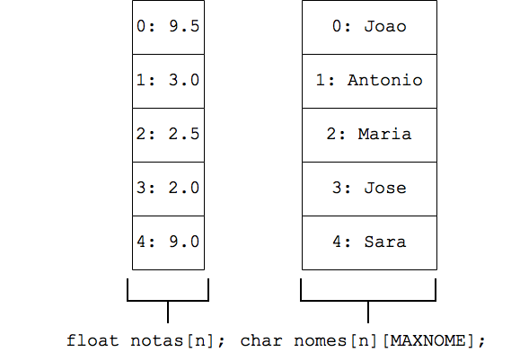
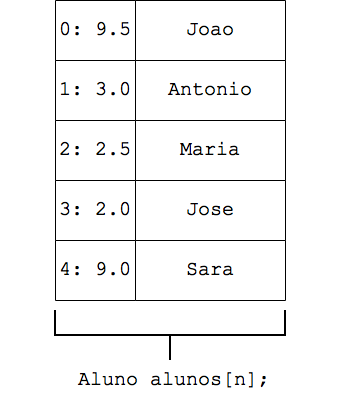

### Linguagem de Programação
#### Tipos Estruturados I
---

### Nas Aulas Anteriores

- Strings
---

### Objetivo da Aula
Introduzir o uso de tipos estruturados
- Conceito
- Sintaxe de definição e uso em programas
---

### Motivação
#### Exercício
Considere o seguinte problema:

- Ler do usuário o nome e a nota de 5 alunos
- Imprimir o nome dos alunos com nota inferior à média de todas as notas
---

### Motivação
#### Exercício - Solução I
```C++
const int STRMAX = 21;

int main(){
  int n = 5, i;
  char nomes[n][STRMAX];
  float notas[n], media = 0.0;
  for(i = 0; i < n; i++){
    cout << "Insira o nome do aluno: ";
    cin.getline(nomes[i], STRMAX);
    cout << "Insira a nota do aluno: ";
    cin >> notas[i];
    cin.ignore();
    media += notas[i];
  }
  media /= n;
  for(i = 0; i < n; i++){
    if(notas[i] < media){
      cout << nomes[i]
           << " esta abaixo da media\n";
    }
  }
  return 0;
}
```
---

### Motivação
#### Representação em Memória - Solução com Par de Vetores
<table>
<tr>
<td>

<td>

Na solução utilizada:
- Dois vetores, um para os
  nomes e outro para as notas
- Nome/nota de um aluno em
  uma mesma posição
- Programas sujeitos a falhas
---

### Motivação
E se fossem solicitados dados adicionais para um aluno?
- Nome
- Nota
- Matrícula
- CPF

Existe alguma alternativa a utilizar vários vetores, sendo
um para cada dado?

---

### Tipos Estruturados
- Mecanismo disponibilizado pela linguagem C++
  - Também conhecido como registros ou estruturas
- Permite ao programador definir um novo tipo de variável
- Agrupa dados de **diferentes tipos**
- Dados possuem __campos__, também chamados de membros,
  atributos ou propriedades
---

### Definindo um Tipo Estruturado

> Tipos estruturados são usados para permitir
> que um programa possua variáveis que representam
> "coisas" do mundo real

---

### Definindo um Tipo Estruturado

Então, pense no que você quer representar
e que características dela devem estar
no programa:
- Aluno, com nome e nota
- Conta bancária, com número, saldo e nome do titular
- Cidade, com nome e população
- etc.

---

### Definindo um Tipo Estruturado
#### Sintaxe

A definição de tipos estruturados deve vir antes das funções
e possui a seguinte sintaxe:

```C++
struct nome_tipo{
  tipo_campo_1 nome_campo_1;
  ...
  tipo_campo_N nome_campo_N;  
};
```
Note o `;` (ponto e vírgula) após a última chave

---

### Definindo um Tipo Estruturado
#### Sintaxe

```C++
struct nome_tipo{
  tipo_campo_1 nome_campo_1;
  ...
  tipo_campo_N nome_campo_N;  
};
```
- `nome_tipo` é o nome do tipo estruturado. É uma boa prática definir um tipo
  com a primeira letra maiúscula
---

### Definindo um Tipo Estruturado
#### Sintaxe

```C++
struct nome_tipo{
  tipo_campo_1 nome_campo_1;
  ...
  tipo_campo_N nome_campo_N;  
};
```
- `tipo_campo` é o tipo (`char`, `int`, `float`...)
  do campo do tipo estruturado
---

### Definindo um Tipo Estruturado
#### Sintaxe

```C++
struct nome_tipo{
  tipo_campo_1 nome_campo_1;
  ...
  tipo_campo_N nome_campo_N;  
};
```
- `nome_campo` é o nome do campo do tipo estruturado e
  obedece às mesmas regras de nomear variáveis
---

### Exercícios
Definir cada um dos tipos estruturados a seguir:

1. Tipo estruturado para um ponto no plano 2D
2. Tipo estruturado para conta bancária, com número da agência, número da conta e
   nome do titular
3. Tipo estruturado para data, com dia, mês e ano
4. Tipo estruturado para funcionário, com nome, matrícula,
   salário, data de nascimento e data de admissão
---

### Solução
#### 1 - Ponto no Plano 2D
```C++
struct Ponto2D{
  float x;
  float y;
};
```
---

### Solução
#### 2 - Conta Bancária
```C++
struct Conta{
  int agencia;
  int numero;
  char titular[STRMAX];
};
```
---

### Solução
#### 3 - Data
```C++
struct Data{
  int dia;
  int mes;
  int ano;
};
```
---

### Solução
#### 4 - Funcionário
Assumindo que o tipo `Data` também tenha sido definido:
```C++
struct Funcionario{
  char nome[STRMAX];
  int matricula;
  float salario;
  Data data_nascimento;
  Data data_admissao;
};
```
Ou seja, é possível utilizar tipos estruturados como campos
de outro tipo estruturado
---

### Definindo um Tipo Estruturado
#### Exemplo - Aluno

Para o exemplo que motivou a aula, um tipo estruturado
chamado `Aluno` deve ser definido, contendo os campos `nome` e `nota`:
```C++
struct Aluno{
  char nome[STRMAX];
  float nota;
};
```
---

### Lista de Presença


<a href="https://bit.ly/3VjwLZr"><p style="text-align:center;">https://bit.ly/3VjwLZr</p></a>

---

### Utilizando Variáveis do Tipo Estruturado

Atenção: **um tipo estruturado não é uma função**

---

### Utilizando Variáveis do Tipo Estruturado
#### Declaração de Variáveis

Após um tipo estruturado ter sido definido, é possível
declarar variáveis do tipo estruturado:

```C++
Aluno a1, a2; //declara duas variáveis do tipo Aluno
```

Toda variável do tipo `Aluno` possui campos `nome` e `nota`
que devem ser acessados nos programas

---

### Utilizando Variáveis do Tipo Estruturado
#### Acesso aos Campos de Variáveis

Após serem declaradas, variáveis de um tipo
estruturado podem ter seus campos acessados
por meio do operador `.` (ponto):

```C++
Aluno a;
...

cin.getline(a.nome,SMAX); //acessa o nome de um aluno para leitura
cin >> a.nota; //acessa a nota de um aluno para leitura
```

---

### Utilizando Variáveis do Tipo Estruturado
#### Declaração de Variáveis

Os campos do tipo `Aluno` funcionam como variáveis
do tipo declarado no campo:

- `nome` funciona como string
- `nota` funciona como `float`

---

### Utilizando Variáveis do Tipo Estruturado
#### Acesso aos Campos de Variáveis

No exemplo abaixo, os campos são acessados
para serem impressos na tela:

```C++
Aluno a;
...

cout << "Nome: " << a.nome << endl; //imprime nome de um aluno
cout << "Nota: " << a.nota << endl; //imprime nota de um aluno
```
---

### Utilizando Variáveis do Tipo Estruturado
#### Declaração de Variáveis

As variáveis do tipo estruturado
possuem seus campos inicializados com lixo.
Para evitar isto:

```C++
Aluno a; //declara variável do tipo Aluno
strcpy(a.nome, ""); //atribui string vazia ao nome
a.nota = 0.0; //atribui zero à nota
```
---

### Utilizando Variáveis do Tipo Estruturado
#### Atribuição de Variáveis do Tipo Estruturado

É possível fazer uma variável de um tipo estruturado
receber uma outra do mesmo tipo:

```C++
Aluno a1, a2;
a1 = a2; //atribuição funciona como esperado (atribui o valor de cada campo)

//Equivalente a :
a1.nota = a2.nota;
strcpy(a1.nome, a2.nome);
```

Observe como seria trabalhoso copiar uma variável
para outra desta última forma se ela contivesse
muitos campos

---

### Utilizando Variáveis do Tipo Estruturado
#### Vetores de Tipo Estruturado
Também é possível declarar vetores do
tipo estruturado definido:

```C++
Aluno vet_alunos[10]; //vetor com capacidade
                      //para armazenar 10 variáveis do tipo Aluno
```
---

### Utilizando Variáveis do Tipo Estruturado
#### Matrizes de Tipo Estruturado
Assim como também é possível declarar matrizes do
tipo estruturado definido:

```C++
Aluno mat_alunos[10][10]; //matriz com capacidade
                          //para armazenar 10x10 variáveis do tipo Aluno
```
---

### Utilizando Variáveis do Tipo Estruturado
#### Acesso aos Campos de Vetores de Tipo Estruturado
Para acessar um campo de uma variável presente em um
vetor de um tipo estruturado:

1. Utilize um __número inteiro__ para acessar uma __posição__
   do vetor
2. Utilize o operador __`.`__ para acessar o __campo__ da variável
   que está nesta posição

```C++
Aluno vet_alunos[10];
...
cout << "Nome: " <<  vet_alunos[i].nome << endl; //imprime nome do Aluno na posição i
cout << "Nota: " <<  vet_alunos[i].nota << endl; //imprime nota do Aluno na posição i

```
---

### Exercício
Considerando o problema apresentado no início da aula:

- Ler do usuário o nome e a nota de 5 alunos
- Imprimir o nome dos alunos com nota inferior à média de todas as notas

Como ficaria o mesmo com o uso de tipos estruturados?
---

### Solução
#### Uso de Tipos Estruturados
```C++
const int STRMAX = 21;

struct Aluno{
  char nome[STRMAX];
  float nota;
};

int main(){
  int n = 5, i;
  Aluno alunos[n];
  float media = 0.0;

  for(i = 0; i < n; i++){
    cout << "Insira o nome do aluno: ";
    cin.getline(alunos[i].nome, STRMAX);
    cout << "Insira a nota do aluno: ";
    cin >> alunos[i].nota;
    cin.ignore();
    media += alunos[i].nota;
  }
  media /= n;

  for(i = 0; i < n; i++){
    if(alunos[i].nota < media){
      cout << alunos[i].nome
           << " esta abaixo da media\n";
    }
  }
  return 0;
}
```
---

### Solução
#### Representação em Memória - Solução com Uso de Tipos Estruturados

<table>
<tr>
<td>

<td>

Com tipos estruturados:
- Único índice utilizado para todos os dados
  de um aluno
- Todos os campos de um aluno em uma mesma variável
- Programas menos sujeitos a falhas

---

### Exercício 1

Defina um tipo estruturado `Data`, com os campos `dia`,
`mes` e `ano`.
Em seguida, implemente um programa que leia do usuário
o dia, mês e ano de duas datas e armazene estes valores
em variáveis do tipo `Data`.

O programa deve imprimir qual das duas datas é cronologicamente
maior. Por exemplo 12/12/2007 é maior do que 09/03/2000.

---

### Exercício 1
#### Solução
```C++
struct Data{
  int dia;
  int mes;
  int ano;
};

int main(){
  Data d1, d2, maior;

  cout << "Insira a 1a. data:\n";
  cin >> d1.dia >> d1.mes >> d1.ano;
  cout << "Insira a 2a. data:\n";
  cin >> d2.dia >> d2.mes >> d2.ano;

  if(d1.ano > d2.ano){
    maior = d1;
  }
  else if(d2.ano > d1.ano){
    maior = d2;
  }
  else{
    if(d1.mes > d2.mes){
      maior = d1;
    }
    else if(d2.mes > d1.mes){
      maior = d2;
    }
    else{
      if(d1.dia > d2.dia){
        maior = d1;
      }
      else{
        maior = d2;
      }
    }
  }
  cout << "Maior data: " << maior.dia << "/"
                         << maior.mes << "/"
                         << maior.ano << endl;

  return 0;
}
```
---

### Exercício 2

Defina um tipo estruturado para representar um `Ponto2D`,
isto é, um ponto com coordenadas `x` e `y`.
Em seguida, implemente um programa que leia do usuário
uma quantidade `n` e as coordenadas `(x,y)` de `n` `Pontos2D`.

O programa deve imprimir o `Ponto2D` mais próximo da origem,
sabendo-se que a distância de um ponto para a origem
é calculada por `$d(p) = \sqrt{p.x^2 + p.y^2}$`.

---

### Exercício 2
#### Solução
```C++
#include &lt;cmath&gt; //para sqrt e pow

using namespace std;

struct Ponto2D{
  float x;
  float y;
};

int main(){
  int n, i;
  float dist, menor_dist;

  cout << "Insira a quantidade de pontos:\n";
  cin >> n;
  Ponto2D pts[n], mais_prox;

  cout << "Insira as coordenadas dos pontos:\n";
  for(i = 0; i < n; i++){
    cin >> pts[i].x >> pts[i].y;
  }

  mais_prox = pts[0];
  float dist;
  float menor_dist = sqrt(pow(pts[0].x,2) +
                          pow(pts[0].y,2));
  for(i = 1; i < n; i++){
    dist = sqrt(pow(pts[i].x,2) + pow(pts[i].y,2));
    if(dist < menor_dist){
      dist = menor_dist;
      mais_prox = pts[i];
    }
  }
  
  cout << "Ponto mais proximo: "
       << mais_prox.x << ", "
       << mais_prox.y << endl;

  return 0;
}
```
---

### Sumário
Na aula de hoje:
- Definição de tipos estruturados
- Operações com variáveis de tipos estruturados
- Vetores de variáveis de tipos estruturados
- Exercícios
---
