### Linguagem de Programação
#### Ordenação
---

### Nas Aulas Anteriores

- Tipos estruturados

---

### Objetivo da Aula

- Introduzir uma solução para ordenação de vetores

---

### Ordenação

- O problema de ordenação possui diversas soluções
- Ordenação pode fazer parte de soluções de programas maiores

---

### Ordenação
#### Ideia do Algoritmo

  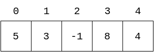

- Ordenar vetor de números inteiros acima em ordem crescente:
  - Percorra cada elemento do vetor
  - Chame o elemento na posição atual de chave, e compare-o com __todos__
    os elementos que estão em posições após ele
  - Realize uma troca entre o elemento comparado e o elemento chave caso este
    último seja maior
  
---

### Ordenação
#### Exemplo - Vetor de Inteiros 1/11

  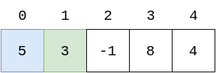

- Elemento __chave__: `v[0] = 5`
- Elemento **comparado**: `v[1] = 3`
- `v[0] > v[1]` $\rightarrow$ verdadeiro,
  trocar `v[0]` com `v[1]`
- Ir para o próximo elemento a ser comparado
  
---

### Ordenação
#### Exemplo - Vetor de Inteiros 2/11

  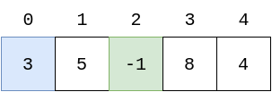

- Elemento __chave__: `v[0] = 3`
- Elemento **comparado**: `v[2] = -1`
- `v[0] > v[2]` $\rightarrow$ verdadeiro,
  trocar `v[0]` com `v[2]`
- Ir para o próximo elemento a ser comparado
  
---

### Ordenação
#### Exemplo - Vetor de Inteiros 3/11

  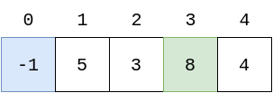

- Elemento __chave__: `v[0] = -1`
- Elemento **comparado**: `v[3] = 8`
- `v[0] > v[3]` $\rightarrow$ falso,
- Ir para o próximo elemento a ser comparado
  
---

### Ordenação
#### Exemplo - Vetor de Inteiros 4/11

  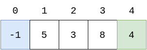

- Elemento __chave__: `v[0] = -1`
- Elemento **comparado**: `v[4] = 4`
- `v[0] > v[4]` $\rightarrow$ falso,
- Fim das comparações com o elemento chave atual:
  ir para o próximo elemento chave e recomeçar comparações
  com todos depois dele
  
---

### Ordenação
#### Exemplo - Vetor de Inteiros 5/11

  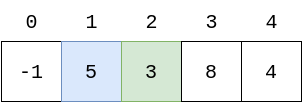

- Elemento __chave__: `v[1] = 5`
- Elemento **comparado**: `v[2] = 3`
- `v[1] > v[2]` $\rightarrow$ verdadeiro,
  trocar `v[1]` com `v[2]`
- Ir para o próximo elemento a ser comparado
  
---

### Ordenação
#### Exemplo - Vetor de Inteiros 6/11

  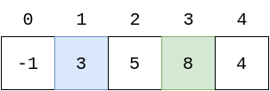

- Elemento __chave__: `v[1] = 3`
- Elemento **comparado**: `v[3] = 8`
- `v[1] > v[3]` $\rightarrow$ falso,
- Ir para o próximo elemento a ser comparado
  
---

### Ordenação
#### Exemplo - Vetor de Inteiros 7/11

  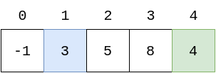

- Elemento __chave__: `v[1] = 3`
- Elemento **comparado**: `v[4] = 4`
- `v[1] > v[4]` $\rightarrow$ falso,
- Fim das comparações com o elemento chave atual: ir para o próximo
  elemento chave e recomeçar comparações com todos depois dele
  
---

### Ordenação
#### Exemplo - Vetor de Inteiros 8/11

  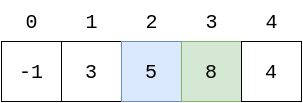

- Elemento __chave__: `v[2] = 5`
- Elemento **comparado**: `v[3] = 8`
- `v[2] > v[3]` $\rightarrow$ falso,
- Ir para o próximo elemento a ser comparado
  
---

### Ordenação
#### Exemplo - Vetor de Inteiros 9/11

  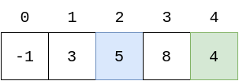

- Elemento __chave__: `v[2] = 5`
- Elemento **comparado**: `v[4] = 4`
- `v[2] > v[4]` $\rightarrow$ verdadeiro,
  trocar `v[2]` com `v[4]`
- Fim das comparações com o elemento chave atual: ir para o próximo
  elemento chave e recomeçar comparações com todos depois dele
  
---

### Ordenação
#### Exemplo - Vetor de Inteiros 10/11

  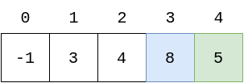

- Elemento __chave__: `v[3] = 8`
- Elemento **comparado**: `v[4] = 5`
- `v[3] > v[4]` $\rightarrow$ verdadeiro,
  trocar `v[3]` com `v[4]`
- Fim das comparações com o elemento chave atual. O último
  elemento chave não possui nenhum elemento após ele.
  Portanto, o algoritmo deve terminar
  
---

### Ordenação
#### Exemplo - Vetor de Inteiros 11/11

  

- Todas as comparações realizadas
- O vetor está ordenado
  
---

### Ordenação
#### Generalizando o Raciocínio
- O elemento __chave__ é `v[i]`
- O elemento **comparado** é `v[j]`
- Observe que:
  - É necessário um laço que percorra os índices `0,1,...,n-2`,
    para cada elemento atual:<br>
    `for(i = 0; i < n-1; i++)`
---

### Ordenação
#### Generalizando o Raciocínio
- Observe que:
  - É necessário um laço que passe por cada elemento a ser comparado
    que está depois do elemento atual:<br>
    `for(j = i+1; j < n; j++)`
---

### Ordenação
#### Generalizando o Raciocínio
- Observe que:
  - Elementos na parte ordenada do vetor não devem ser comparados:
    isto deixará o algoritmo incorreto
---

### Ordenação
#### Generalizando o Raciocínio
- Observe que:
  - Fora isso, basta incluir as operações de comparação e troca entre elementos
---

### Ordenação
#### Código da Função - Ordem Crescente

```C++
//vetor v é parâmetro de entrada e saída
void ordena_crescente(int v[], int n){
    int i, j, aux;
    for(i = 0; i < n-1; i++){
        for(j = i+1; j < n; j++){
            if(v[i] > v[j]){
                aux = v[i];
                v[i] = v[j];
                v[j] = aux;
            }
        }
    }
}
```

---

### Ordenação
#### Função `main`

```C++
int main(){
    int n, i;
    cin >> n;
    int v[n];
    for(i = 0; i < n; i++){
        cin >> v[i];
    }
    ordena_crescente(v, n);
    for(i = 0; i < n; i++){
        cout << v[i] << " ";
    }
    cout << endl;
    return 0;
}
```

---

### Lista de Presença


<a href="https://bit.ly/3NKsoBW"><p style="text-align:center;">https://bit.ly/3NKsoBW</p></a>

---

### Exercício

Utilizando um tipo estruturado `Aluno`,
que deve possuir nome, matrícula e nota,
implemente uma função que ordene um vetor com `n` alunos
por ordem crescente de nota.<br><br>

Implemente também a função `main`, de modo que o usuário
possa inserir a quantidade de alunos `n`, o nome, matrícula e a nota
para cada um dos `n` alunos e então visualizar na tela os dados
de todos os alunos ordenados por nota.

---

### Ordenação
#### Solução - Ordem Crescente de Notas

```C++
void ordena_crescente(Aluno v[], int n){
    int i, j;
    Aluno aux;
    for(i = 0; i < n-1; i++){
        for(j = i+1; j < n; j++){
            if(v[i].nota > v[j].nota){
                aux = v[i];
                v[i] = v[j];
                v[j] = aux;
            }
        }
    }
}
```

---

### Ordenação
#### Solução - Função `main`

```C++
int main(){
    int n, i;
    cin >> n;
    Aluno alunos[n];
    for(i = 0; i < n; i++){
        cin.ignore();
        cin.getline(alunos[i].nome, MAXNOME);
        cin >> alunos[i].matricula;
        cin >> alunos[i].nota;
    }
    ordena_crescente(alunos, n);
    for(i = 0; i < n; i++){
        cout << alunos[i].nome << " "
             << alunos[i].matricula << " "
             << alunos[i].nota << endl;
    }
    return 0;
}
```

---

### Outros Exercícios

- E quanto à ordenação por matrícula?
- E quanto à ordenação por ordem decrescente?
- **E quanto à ordenação por ordem alfabética?**

---

### Ordenação
#### Ordem Alfabética

Função `strcmp` - duas strings como parâmetros:
- Retorna um número negativo se a string do primeiro parâmetros for menor
- Retorna um número positivo se a string do primeiro parâmetros for maior
- Retorna 0 se as strings são iguais

---

### Ordenação
#### Ordem Alfabética

Então, para ordenar alfabeticamente:
- `strcmp(alunos[i].nome, alunos[j].nome)` retorna um número positivo
  se o nome do aluno `i` for alfabeticamente maior do que o nome do aluno `j`

---

### Ordenação
#### Solução - Ordem Alfabética

```C++
void ordena_alfabeticamente(Aluno v[], int n){
    int i, j;
    Aluno aux;
    for(i = 0; i < n-1; i++){
        for(j = i+1; j < n; j++){
            if(strcmp(v[i].nome, v[j].nome) > 0){
                aux = v[i];
                v[i] = v[j];
                v[j] = aux;
            }
        }
    }
}
```

---

### Sumário
Na aula de hoje:
- Ordenação
- Ordenação com tipos estruturados
  - Ordem crescente/decrescente de campos numéricos
  - Ordem alfabética de campos string

---
