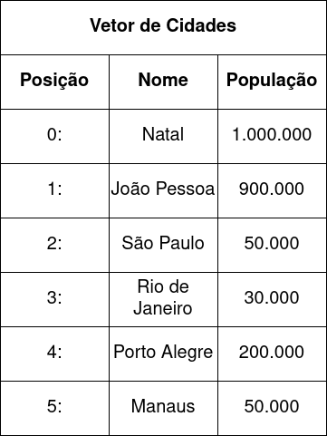
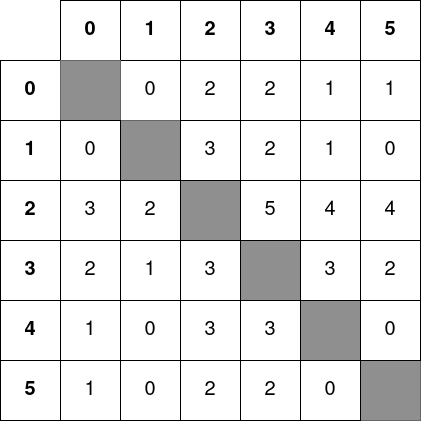

### Linguagem de Programação
#### Aplicações com Matriz de Relações
---

### Nas Aulas Anteriores

Tudo :)
- Funções
- Vetores e matrizes
- Strings
- Tipos estruturados

---

### Objetivo da Aula

- Mostrar aplicações do conteúdo da disciplina
  em problemas contendo matrizes de relações

---

### Matriz de Relações

Uma matriz que armazena as relações entre
_coisas_ do mundo real:
- Amizades entre _pessoas_ (redes sociais)
- Distâncias entre _cidades_
- Partidas entre _times_ de futebol
- etc.

---

### Matriz de Relações
#### Exemplo: Voos entre Cidades

Considere o seguinte vetor de `Cidade`:



---

### Matriz de Relações
#### Exemplo: Voos entre Cidades

A matriz armazena quantos voos diários
diretos saem de uma cidade para outra:



---

### Matriz de Relações
#### Exemplo: Voos entre Cidades


Para a relação na linha `i` e coluna `j`:
- Origem é a cidade no vetor na posição `i`
- Destino é a cidade no vetor na posição `j`
- Ex.: na posição `[0][2]`: voos que saem de
  Natal para o Rio de Janeiro

---

### Aplicações Matriz de Relações
#### Exemplo: Voos entre Cidades

Possíveis perguntas:
- Existe voo entre `cidade_a` e `cidade_b`?
- De qual cidade saem mais voos?
- Qual cidade recebe mais voos?
- Existe voo entre `cidade_a` e `cidade_b`, com
   apenas uma conexão?
- É possível partir da `cidade_a` e chegar na `cidade_b`,
   independentemente do número de voos?

---

### Aplicações Matriz de Relações
#### Exemplo: Voos entre Cidades

Para começar a responder a estas perguntas,
o programa deve ler os dados das cidades
no seguinte formato:

```
6
Natal
90000
Campo Grande
916000
Sao Paulo
12400000
Rio de Janeiro
6750000
Porto Alegre
1500000
Manaus
2000000
```
---

### Aplicações Matriz de Relações
#### Exemplo: Voos entre Cidades

Após ler os dados das cidades, os
dados da matriz de relações devem
ser lidos:

```
-1  0  2  2  1  1
 0 -1  3  2  1  0
 3  2 -1  5  4  4
 2  1  3 -1  3  2
 1  0  3  3 -1  0
 1  0  2  2  0 -1
```
---

### Aplicações Matriz de Relações
#### Exemplo: Voos entre Cidades

- Existe voo entre `cidade_a` e `cidade_b`?

Programa:
- Ler os nomes das duas cidades
- Obter a posição `i` da `cidade_a` e
  `j` da `cidade_b`
- Obter valor na matriz na posição `[i][j]`:
  existe voo se este valor for $> 0$

---

### Aplicações Matriz de Relações
#### Exemplo: Voos entre Cidades

> Neste ponto do curso,
> você deve ser capaz de pensar
> por conta própria em:
> - Que tipos estruturados o seu programa deve ter
> - Que funções o seu programa deve ter

---

### Aplicações Matriz de Relações
#### Solução: Voos entre Cidades

```C++
#include <iostream>
#include <cstring>

using namespace std;

const int MAX = 100;
const int SMAX = 31;

struct Cidade{
    char nome[SMAX];
    int populacao;
};

struct Matriz{
    int nl;
    int nc;
    int dados[MAX][MAX];
};

void le_cidades(Cidade v[], int &n, Matriz &m){
    int i, j;

    cin >> n;

    for(i = 0; i < n; i++){
        cin.ignore();
        cin.getline(v[i].nome, SMAX);
        cin >> v[i].populacao;
    }

    m.nl = n;
    m.nc = n;
    for(i = 0; i < m.nl; i++){
        for(j = 0; j < m.nc; j++){
            cin >> m.dados[i][j];
        }
    }
}

void imprime_cidades(Cidade v[], int n){
    int i;

    for(i = 0; i < n; i++){
        cout << v[i].nome << endl;
        cout << v[i].populacao << endl;
    }
}

void imprime_relacoes(Matriz m){
    int i, j;

    for(i = 0; i < m.nl; i++){
        for(j = 0; j < m.nc; j++){
            cout << m.dados[i][j] << " ";
        }
        cout << endl;
    }
}

int acha_indice(Cidade v[], int n, char nome[]){
    int i;

    for(i = 0; i < n; i++){
        if(strcmp(v[i].nome, nome) == 0){
            return i;
        }
    }
    return -1;
}

int voos_diretos(Cidade v[], int n, Matriz relacoes,
                 Cidade orig, Cidade dest){
    int i, j;

    i = acha_indice(v, n, orig.nome);
    j = acha_indice(v, n, dest.nome);

    return relacoes.dados[i][j];
}

int main(){

    Cidade v[MAX], p, q;
    Matriz cidades;
    int i, n;

    le_cidades(v, n, cidades);

    imprime_cidades(v, n);
    imprime_relacoes(cidades);

    cin.ignore(); //cin foi usado em le_cidades
    cout << "Insira a cidade de origem:\n";
    cin.getline(p.nome, SMAX);
    cout << "Insira a cidade de destino:\n";
    cin.getline(q.nome, SMAX);

    cout << "Voos diretos entre " << p.nome
         << " e " << q.nome << ": "
         << voos_diretos(v, n, cidades, p, q)
         << endl; 

    return 0;
}

```
---

### Aplicações Matriz de Relações
#### Exercícios

Implementar programas para responder:
- De qual cidade saem mais voos?
- Qual cidade recebe mais voos?
- Existe voo entre `cidade_a` e `cidade_b`, com
  apenas uma conexão?
- É possível partir da `cidade_a` e chegar na `cidade_b`,
  independentemente do número de voos? $\rightarrow$
  problema estudado em Estrutura de Dados :)

---

### Sumário

Na aula de hoje:
- Aplicações com matrizes de relações

---
